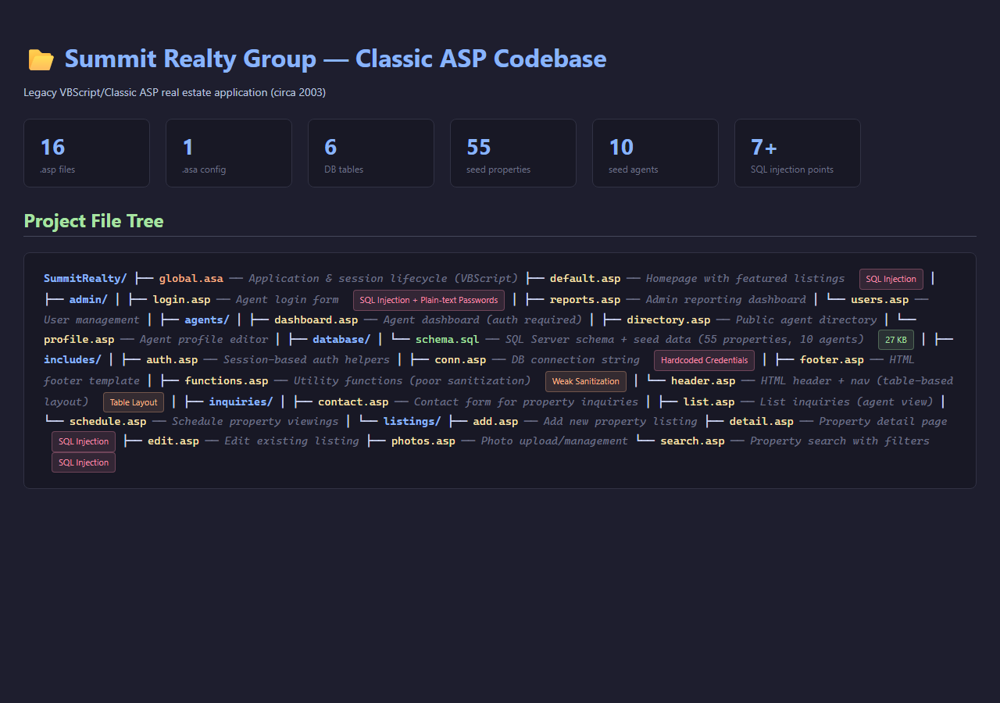
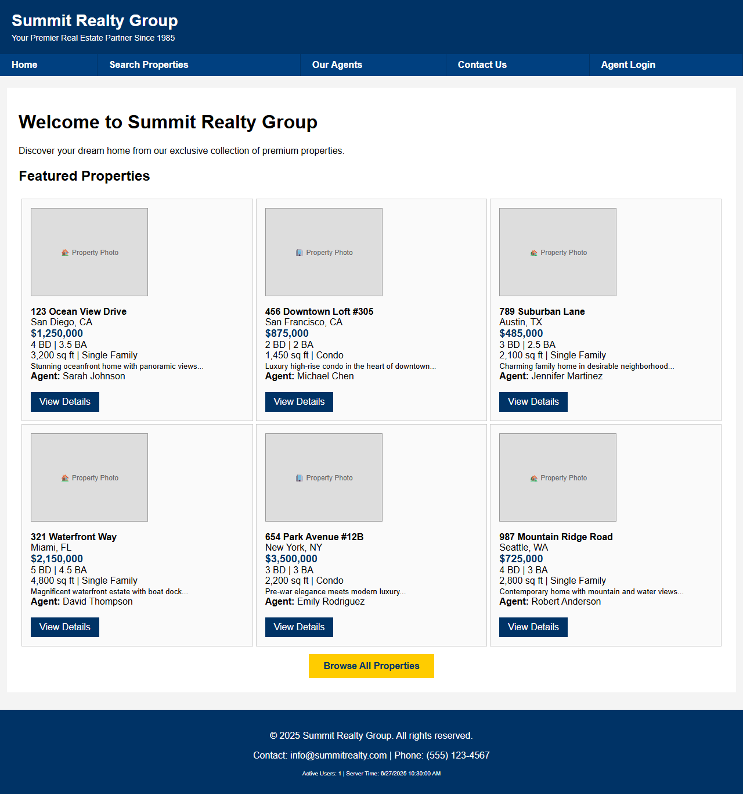
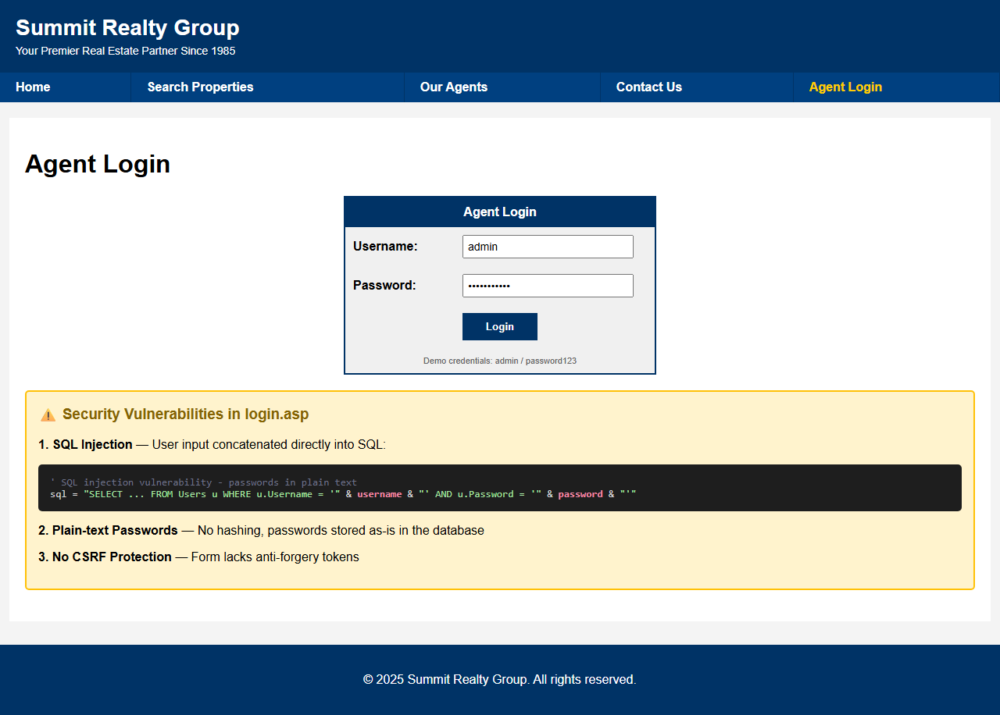
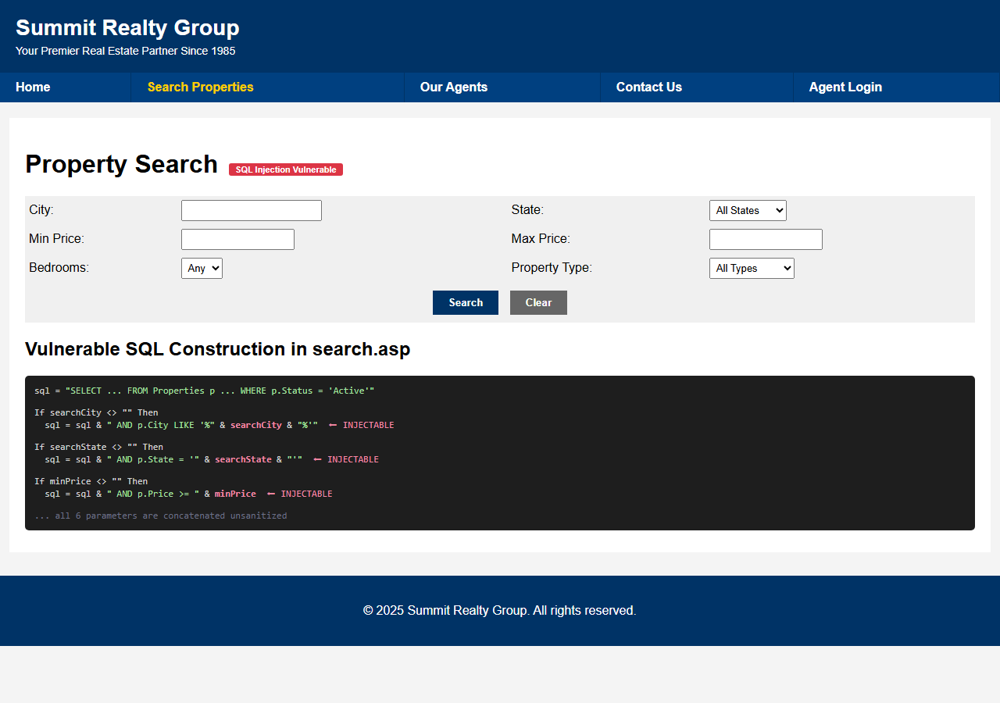
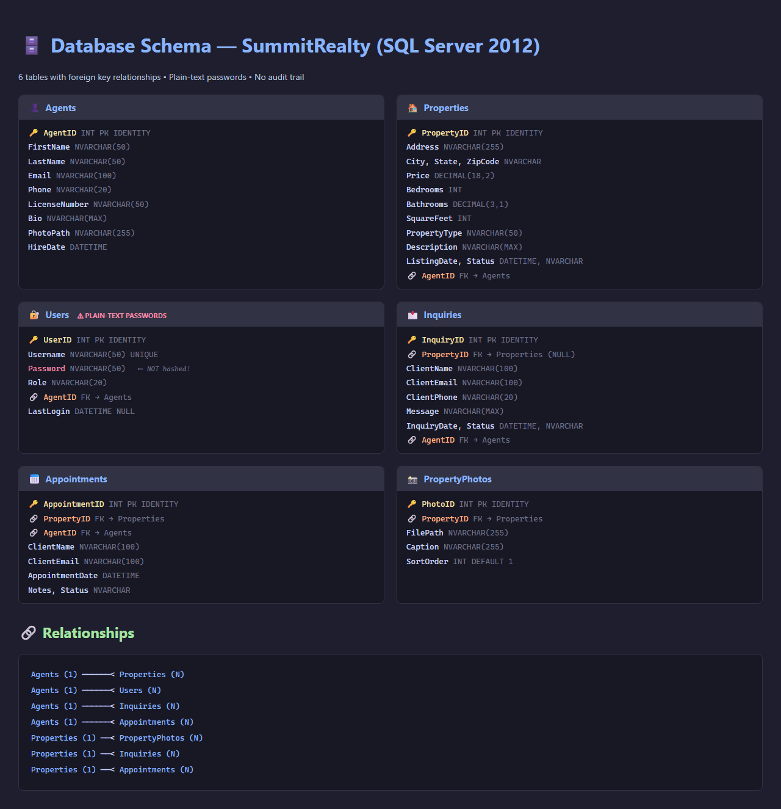
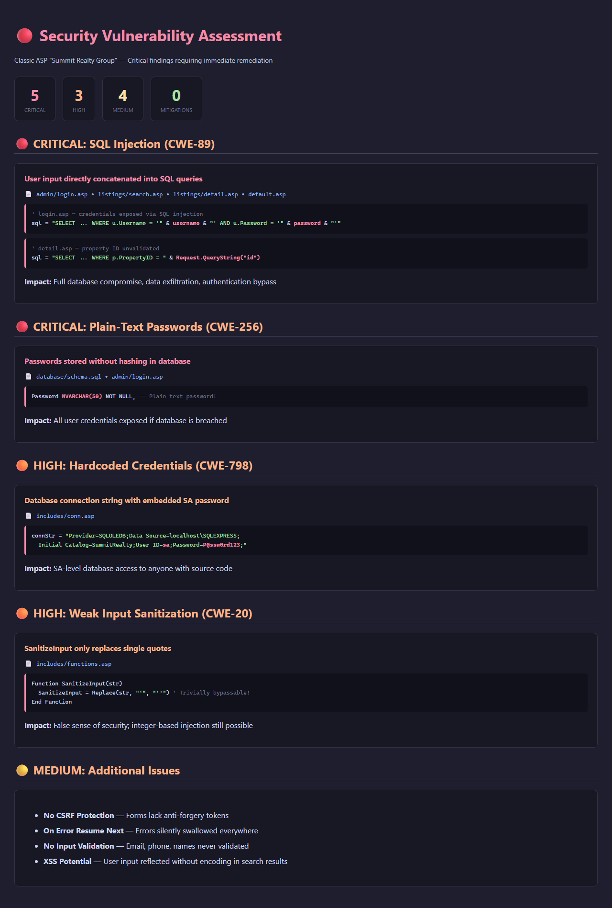

## Initial Application Screenshots

The legacy Summit Realty Group application is a Classic ASP/VBScript real estate website that requires IIS to run. Since it cannot be executed directly, the screenshots below visualize the code structure, UI layout, database schema, and security vulnerabilities identified in the codebase.

### Code Structure Overview
The application consists of 16 `.asp` files organized across admin, agents, listings, inquiries, and shared includes, plus a SQL Server database with 6 tables and 55 seed property listings.

### Homepage (default.asp)
The homepage renders featured property listings in a table-based layout with inline SQL queries (vulnerable to injection). Navigation uses table cells, styling is inline CSS — classic early-2000s patterns.

### Agent Login Page (admin/login.asp)
The login form concatenates user input directly into SQL queries and stores passwords in plain text — two critical security vulnerabilities that must be remediated during modernization.

### Property Search (listings/search.asp)
The search page builds SQL dynamically by concatenating all 6 filter parameters without parameterization, making every search field an injection vector.

### Database Schema (database/schema.sql)
Six tables with foreign key relationships. The `Users` table stores passwords as plain `NVARCHAR(50)` — no hashing. The schema targets SQL Server 2012 Express.

### Security Vulnerability Assessment
A summary of all critical, high, and medium findings across the codebase — SQL injection, plain-text passwords, hardcoded SA credentials, weak sanitization, no CSRF protection, and silent error handling.

